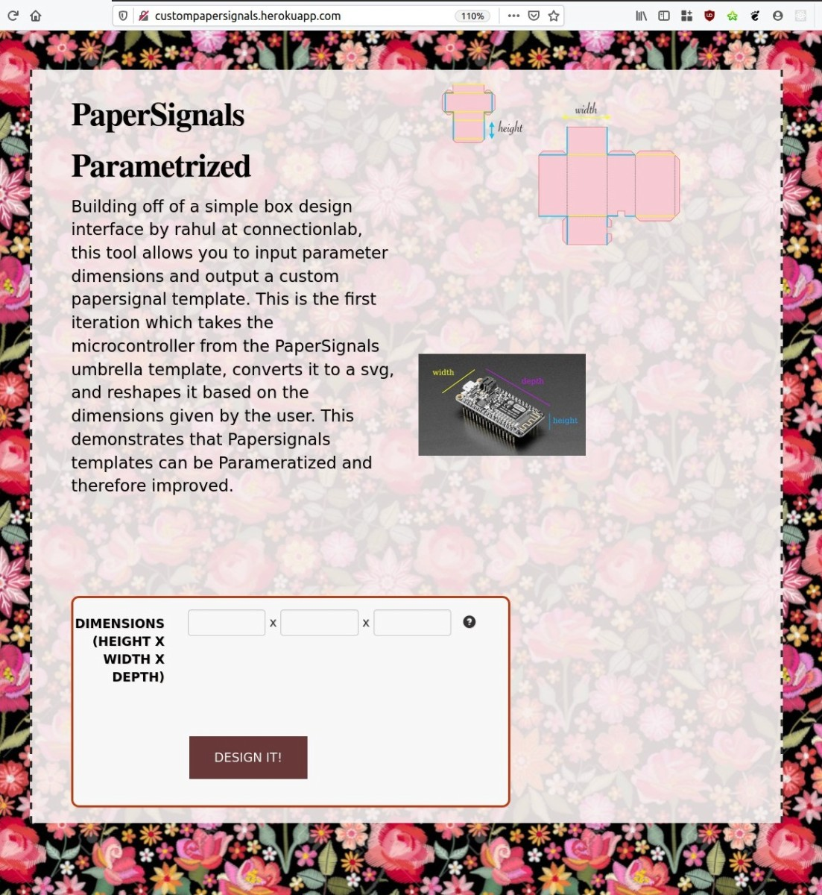

To run:

`python server.py` then go to `127.0.0.1:5000` in the browser.

See 

## Paper Templates

The SVG files in Hardware/Paper Templates, are cleaned up for use on the
lasercutter (otherwise, the default PDFs from Google imported straight into
inkscape/coreldraw, have a lot of "duplicated" lines where the lasercutter will
try to cut it multiple times -- so we recreated / traced the lines manually)

## Firmware Code

ESP8266 code in Hardware/ESP Programs, was having wifi / router issues at home,
and doesn't work on enterprise security (e.g. `eduroam` or `Harvard Secure`).
Used router (known to work with ESPs) from friend (not sure what settings
changed) and connected fine. Also works on cellphone tethering internet.
